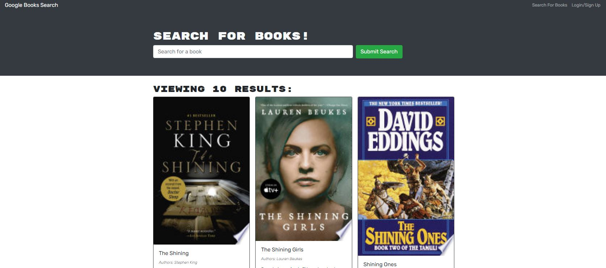

# Your Favorite Reads Search Engine

## Description
Your Favorite Reads is a book search engine which will allow you to find your next favorite book with Google's API. Your results will return an image of the book, the title, the author and a short description of the book. You can sign up/login to be able to save or delete books on your reading list!

## Table Of Contents 
- [Installation](#installation)
- [Usage](#usage)
- [License](#license)
- [Contributing](#contributing)
- [Tests](#tests)
- [Questions](#questions)

## Installation
Git clone this repo. Run `npm install`. Run `npm start`. Navigate to `http://localhost:3000/`.

## Usage
Navigate to the deployed page. Here you can sign up/login or start searching for your next favorite read! In the below screenshot, you can see a search for "The Shining". If you've signed up for an account, you can save the books you're interested in. Once you've read a book on your list you can then delete that book.  
[Deployed Page]()
  

## License
This project is covered under the MIT license. Please refer to this link to read the license, permissions, conditions and limitations.
[License: MIT](https://choosealicense.com/licenses/mit/)

## Contributing
N/A

## Tests
N/A

## Questions
Please reach me by GitHub or Email below with any additional questions about this project:

GitHub: https://github.com/isabella-pettini

Email:  isabellapierce93@gmail.com